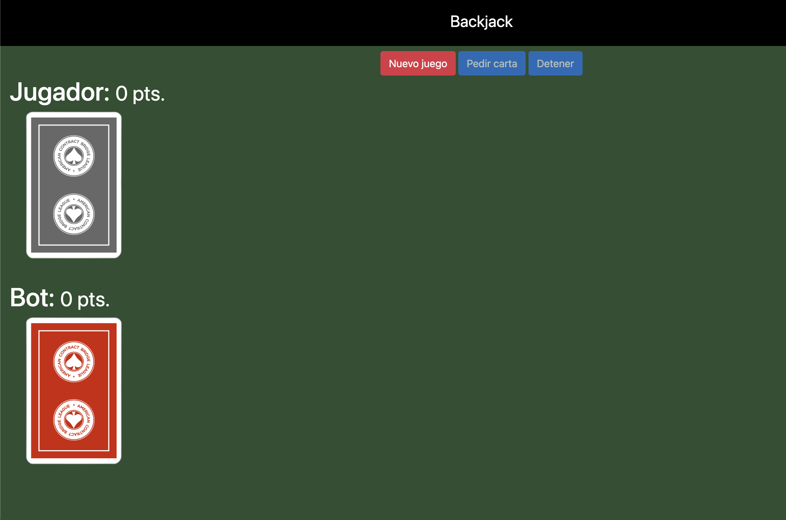

# Blackjack Game

This is a simple implementation of the classic card game Blackjack using JavaScript.

## Instructions

1. Clone or download the repository.

2. Open the `index.html` file in your web browser to start the game.

3. Follow the on-screen instructions to play Blackjack.

## Features

- Basic Blackjack gameplay.
- Player and bot hands.
- Score tracking.

## Screenshots

## Demo

You can play the game online [here](link_to_demo).

## Contributing

Feel free to contribute to this project. If you find any issues or have ideas for improvements, please open an issue or create a pull request.

## License

This project is licensed under the GPL-3.0 License. See the [LICENSE](LICENSE.md) file for details.
